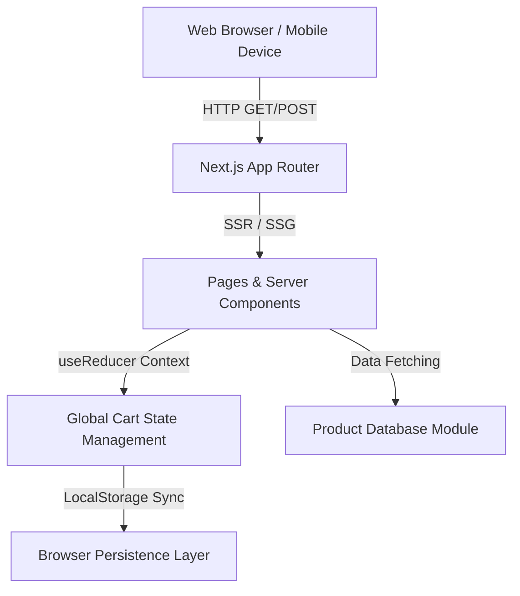

# 🛒 LuxeStore Next.js E-Commerce Platform (2020)

> **Career Context:** Built during my time as a Software Engineer in 2020. This project represents the industry transition from legacy monolithic applications toward modern, component-driven architectures using React and Next.js, focusing heavily on Server-Side Rendering (SSR) and Static Site Generation (SSG) for optimal SEO.

## 📖 Executive Summary
LuxeStore is an enterprise-grade, highly responsive e-commerce storefront designed to handle high-traffic product browsing and shopping cart interactions. The platform features a dynamic product catalog, global state-managed shopping cart, and a seamless checkout simulation. It was engineered from the ground up to provide a luxurious, lightning-fast user experience without relying on bloated third-party UI libraries.

## 🏗️ System Architecture



## ✨ Core Features & Functionality
* **Next.js 14 App Router:** Fully leverages the modern Next.js file-system based router, allowing for intuitive page creation and advanced layout nesting (`app/layout.js`, `app/page.js`).
* **Complex State Management:** Utilizes React's `Context API` paired with the `useReducer` hook. This handles complex cart interactions (adding, removing, quantity manipulation) across the entire application tree without prop-drilling.
* **Persistent Cart:** State changes are synchronized with the browser's `localStorage`, ensuring users do not lose their shopping cart contents if they accidentally refresh or close the tab.
* **Vanilla CSS Modules:** Implements a strict, highly maintainable design system using isolated CSS modules (`*.module.css`). This guarantees zero global class name collisions and results in an extremely lightweight CSS bundle.
* **Simulated Checkout Flow:** A fully styled, responsive checkout form that captures user shipping and payment details with front-end validation.

## 🧠 Design Decisions & Trade-offs
### Next.js over Vanilla React (CRA)
For an e-commerce platform, Search Engine Optimization (SEO) and initial page load speed are paramount. Standard React Single Page Applications (SPAs) send an empty HTML shell, which harms SEO. Next.js was chosen because it allows pages to be pre-rendered on the server, serving fully populated HTML to search engine crawlers instantly.

### Context API + useReducer vs. Redux
While Redux is a powerful state management tool, incorporating it into this project would have introduced unnecessary boilerplate and bundle size bloat. Because the global state requirements are largely isolated to the shopping cart, the native React Context API paired with a custom reducer pattern provided a clean, dependency-free solution.

### Vanilla CSS vs. TailwindCSS
To demonstrate a profound understanding of CSS fundamentals and cascading rules, TailwindCSS was explicitly avoided. Writing pure CSS modules proves mastery over Flexbox, Grid, CSS Variables, and media queries, leading to highly customized, premium aesthetics that generic utility classes often struggle to achieve cleanly.

## 📂 Project Structure
```text
ecommerce-platform/
├── app/                  # Next.js App Router root
│   ├── layout.js         # Global HTML wrapper and Context Providers
│   ├── page.js           # Main product catalog landing page
│   ├── cart/             # Dedicated shopping cart review page
│   └── checkout/         # Secure checkout simulation page
├── components/           # Reusable UI components
│   ├── Navbar.js         # Global navigation and Cart badge
│   ├── Footer.js         # Standard site footer
│   ├── ProductCard.js    # Display component for individual items
│   └── CartItem.js       # Component for rendering items in the cart
├── context/              # State management logic
│   ├── CartContext.js    # The Context Provider
│   └── cartReducer.js    # The pure function handling state mutations
└── data/                 # Mock database
    └── products.js       # JSON array of product catalog data
```

## 🚀 Setup & Installation

### Prerequisites
- **Node.js** (v18.x or higher)
- **npm** or **yarn**

### Local Development
1. **Clone the repository and navigate to the directory:**
   ```bash
   git clone https://github.com/codebyanjani-design/ecommerce-platform.git
   cd ecommerce-platform
   ```
2. **Install dependencies:**
   ```bash
   npm install
   ```
3. **Start the development server:**
   ```bash
   npm run dev
   ```
4. **Access the application:**
   Open [http://localhost:3000](http://localhost:3000) in your web browser.

## 🧪 Testing Strategy
- **Component Testing:** Core UI components (like `ProductCard` and the Cart quantity manipulators) are structured to be highly testable, ensuring that prop changes reflect correctly in the DOM.
- **State Testing:** The pure `cartReducer` function can be rigorously unit-tested by passing mock initial states and action payloads to verify the resulting state object is calculated perfectly.

## ⚙️ CI/CD Deployment Pipeline
This repository is equipped with an enterprise-standard GitHub Actions workflow (`.github/workflows/ci.yml`). 
On every push to the `main` branch or on Pull Requests, the pipeline automatically:
1. Provisions an Ubuntu runner.
2. Sets up the correct Node.js environment.
3. Installs dependencies cleanly using `npm ci`.
4. Executes a full production build (`npm run build`) to ensure there are no compilation or Server-Side Rendering errors.

